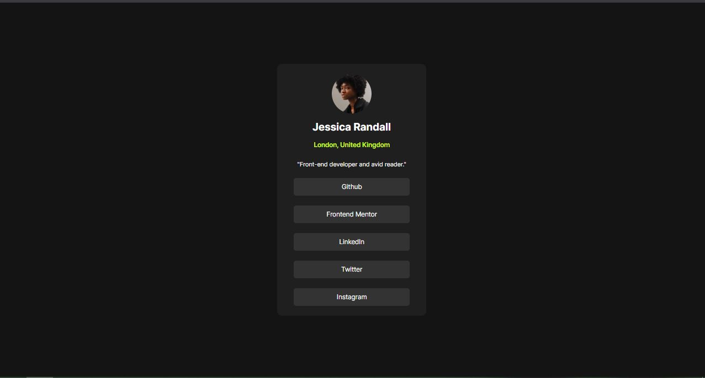

# Frontend Mentor - Social Links Profile Solution

This is my solution to the **Social Links Profile** challenge on Frontend Mentor. The goal of this project was to recreate the provided design using semantic HTML and modern CSS while following clean and maintainable coding practices.

## Overview

### Screenshot

### Links

- **Solution URL:** https://github.com/eduardoseq17/SocialLinksProfile.github.io
- **Live Site URL:** https://eduardoseq17.github.io/SocialLinksProfile.github.io/

## Built with

- Semantic HTML5
- CSS Custom Properties (Variables)
- Flexbox
- Custom local fonts with `@font-face`
- Mobile-first workflow

## What I learned

While building this project, I practiced:

- Using semantic HTML elements such as `<article>`, `<header>`, `<ul>`, and `<li>`.
- Organizing CSS with custom properties to improve maintainability.
- Building layouts using Flexbox.
- Importing and using local variable fonts with `@font-face`.
- Creating reusable and well-structured CSS.
- Improving code readability through consistent property organization.

## Continued development

In future projects, I want to continue improving my:

- Responsive design skills.
- Accessibility best practices.
- CSS architecture and reusable components.
- JavaScript fundamentals to build interactive interfaces.

## AI Collaboration

I used ChatGPT as a learning assistant to review my HTML and CSS, receive feedback on semantic structure and code organization, and better understand front-end development best practices.

## Author

- GitHub - https://github.com/eduardoseq17
- Frontend Mentor - https://www.frontendmentor.io/profile/eduardoseq17
